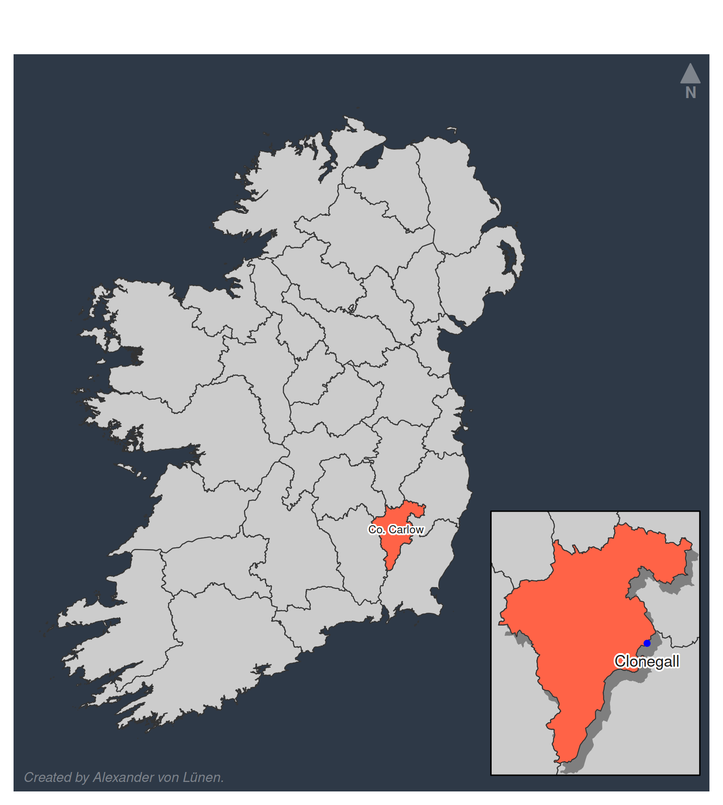

<b>Clonegall, using mapsf</b>

This was for another piece of coursework, where I surveyed monuments in Clonegall, Co. Carlow, Ireland.

This was from the start of my report, where I wanted to give an idea where Clonegall is in the country/county.

The shapefile for the counties was downloaded from townlands.ie; the place coordinates for Clonegall were taken from Wikipedia.

